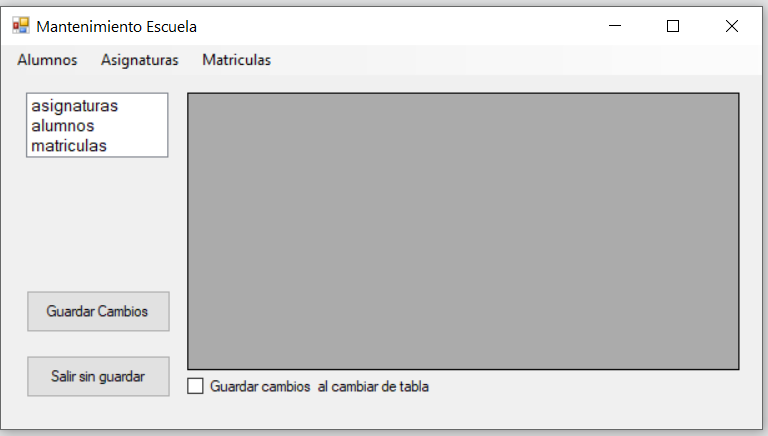
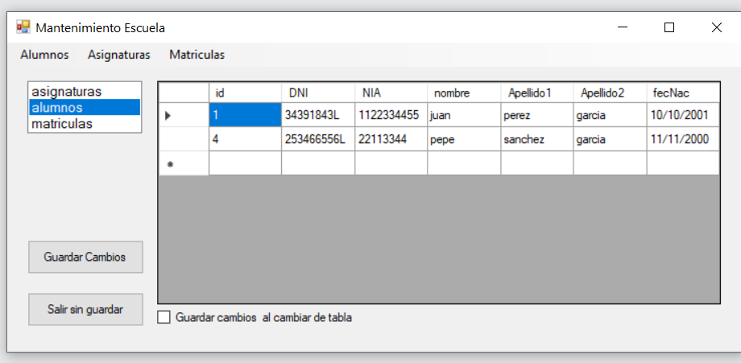
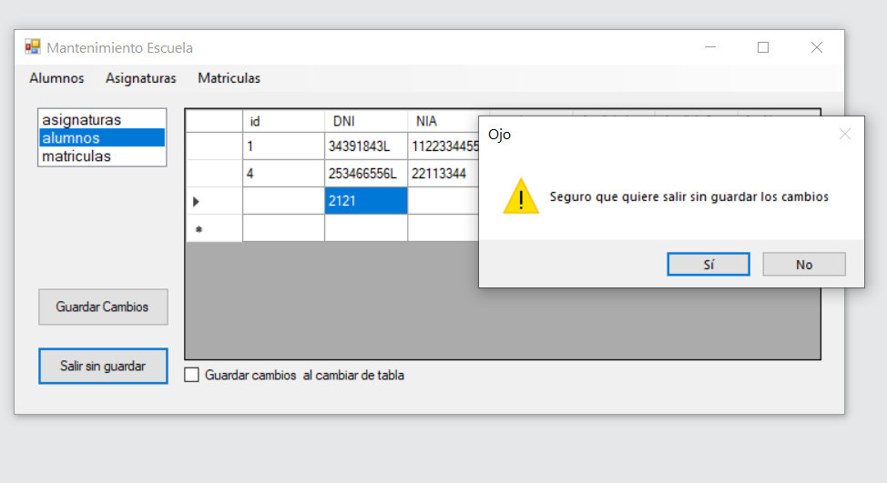

# Mantenimiento de una base de datos desconectada

## Enunciado

Se desea realizar el mantenimiento de las tablas de la BD del centro educativo:

- Alumnos (con los datos del alumno, incluido su expediente),
- Asignaturas (con los datos de las asignaturas, incluido el código de la misma)
- Matricula (que vincula a los alumnos con las asignaturas matriculadas en una fecha).

Para ello, tras crearos la estructura de la BD (en Access o MySQL) se deberá crear un único formulario que permita seleccionar la tabla correspondiente (con un ListBox, por ejemplo) y mostrar los datos.
A partir de esos datos, se podrá insertar, modificar o borrar un registro. Todo este proceso se realizará en modo desconectado.
Si usais MySQL, debeis adjuntar el script correspondiente.

## Resultado

<https://github.com/jrodriguezballester/Mantenimiento-I-BD.git>

  Se realiza con una base de datos MySQL cuyo script se encuentra en la raiz del proyecto: dbescuela.sql

### Vista

Se realiza el siguiente formulario

Donde podemos observar:

- Tanto un menu como un listbox con los nombres de las tablas. Al clickar nos mostrará la tabla correspondiente
- Un datagridview donde se muestra la tabla selecionada
  - AutoSizeColumnsMode Fill para que las columnas ocupen todo el ancho
  - La columna ID de las tablas o no se muestran o son de solo lectura para evitar errores de clave primaria
- Un checkbox que nos permite guardar las tablas automaticamente cuando cambiamos de tabla
- Un boton para guardar los cambios en la base de datos
- Un boton para cerrar la aplicación

### Codigo

- Al cargarse el formulario:
  - Se conecta a la BD
  - Carga el dataset con las tablas
  - Se desconecta de la BD
- CheckBox
  - El CheckBox Guardar es controlado en varios metodos, si esta seleccionado se llama al metodo guardar()
- Menu Item o Listbox
  - Son distintas maneras de hacer lo mismo. Al clickar sobre el menu, o al haber un cambio en el listbox se llama a un método para mostrar la tabla seleccionada
  - Cada vez que son llamados, comprueban el Checkbox

- Guardar
  - Comprueba si hay cambios en el dataSet  dataSet.GetChanges()
  - Si hay cambios los guarda en la BD con adapter.Update()
  - Pone a 0 los cambios  dataSet.AcceptChanges()
- Salir
  - Comprueba si hay cambios en el dataSet
    - Si hay cambios muestra una alerta avisandonos
    - Si no hay cambios cierra el formulario

### Posibles mejoras

- Visualización de los datos de una fila en etiquetas
- Mejorar la vista de la tabla matriculas ya que no aporta informacion
- Control de insercion de datos
- Control de errores
